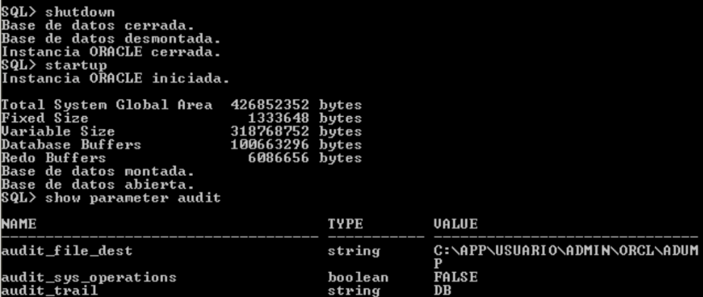
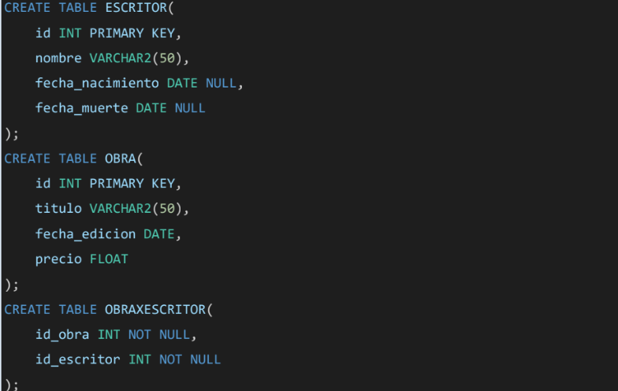
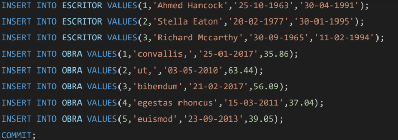
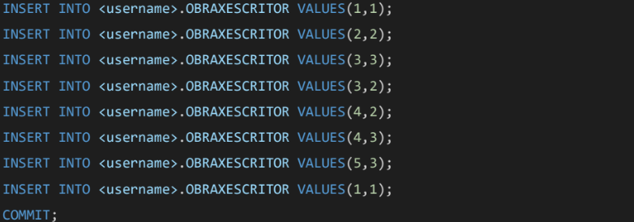
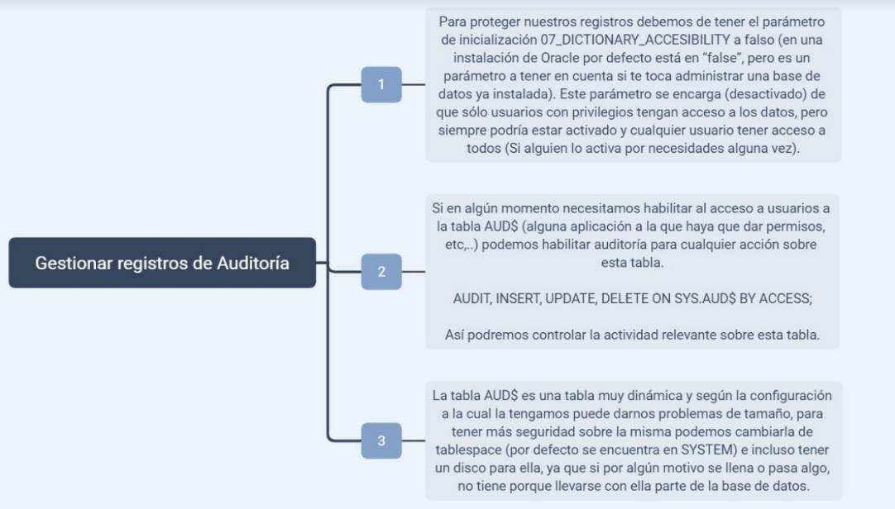

author: Fatima Renderos
summary: Laboratorio sobre Administración de alamacenamiento y usuarios 
id: laboratorio-04
tags: guide. 
categories: Auditorias.
environments: Web
status: Published
feedback link: https://github.com/vareladev/vareladev.github.io/issues

<link rel="stylesheet" href="style.css">

# Auditoría en Oracle 

## Objetivos 
Duration: 0:01:00

* Aprender a activar la auditoría en ORACLE.
* Dominar las vistas donde se almacena la información de auditoría.
* Conocer la forma de auditar:
## Herramientas 
Duration: 0:01:00

Para esta práctica se hará uso de estas herramientas: 

### Oracle DB 19c 


Oracle Database es un sistema de gestión de base de datos de tipo objeto-relacional (ORDBMS, por el acrónimo en inglés de Object-Relational Data Base Management System), desarrollado por Oracle Corporation. Oracle Database 19c es la versión actual a largo plazo, que además proporciona el nivel más alto de estabilidad de la versión y el plazo más largo para asistencia y corrección de errores.

### SQL Developer 


Es una interfaz gráfica de usuario gratuita que permite a los usuarios y administradores de bases de datos realizar sus tareas con menos clicks y pulsaciones de teclas. SQL Developer es una herramienta de productividad cuyo objetivo principal es ayudar al usuario final a ahorrar tiempo y maximizar el retorno de la inversión en el paquete de tecnología de Oracle Database.

## Introducción
Duration: 0:01:00

Esta guía pretende explorar una serie de buenas prácticas de auditoría, así como la
importancia que ésta tiene en el servidor de bases de datos, añadiendo una nueva capa
de seguridad que ayuda a prevenir e identificar sucesos o actividades inusuales y
sospechosas, además de explicar de manera practica el cómo utilizar las herramientas
de auditoría que Oracle nos proporciona.

## Activación de la auditoría en Oracle
Duration: 0:05:00
La auditoría en Oracle consiste en la monitorización y almacenamiento de información
de nuestro servidor Oracle, la auditoría es una parte importante de la seguridad del
sistema que no debe olvidarse.

**Ventajas:**

* Dispondremos de información de las operaciones del sistema.
* Protegeremos mejor nuestro sistema.
* Podemos prevenir ataques y detectar posibles intrusos.

**Inconvenientes:**
* Mayor consumo de recursos del sistema.

Oracle, por defecto no trae activada la auditoría (Hasta la versión 11g), aunque la emplea
en algunas actividades de esta (auditoría obligatoria): el encendido y apagado,
conexiones como sysdba y sysoper. Para activar la auditoría estándar en Oracle,
necesitamos cambiar el parámetro Audit_trail del init.ora (por defecto *“none”*), podemos
ver el estado de este parámetro con el comando *“show parameter audit”*.


El comando para activar la auditoría en oracle es el siguiente:


Las modificaciones del archivo init.ora requieren el reinicio de la base de datos para que
surjan efecto, así que reiniciaremos para aplicar los cambios.




```
También podemos activar la auditoría de operaciones de usuarios con privilegios de
sistema, para ello hacemos lo siguiente:

SQL> ALTER SYSTEM SET audit_sys_operations=true SCOPE=SPFILE;

```

Los valores más comunes que podemos asignar al parámetro audit_trail son los
siguientes:

* none: La auditoría está desactivada.
* db: La auditoría está activada con todos y guarda los registros en la tabla
SYS.AUD$ (tablespace SYSTEM por defecto).
* os: La auditoría está activada, con todos los registros guardados directamente en
el sistema operativo (en un directorio y archivos concretos), está opción depende
del sistema operativo.
* db, extended: La auditoría está activada los datos se almacenarán en la taba
SYS.AUD$. Además, se escribirán los valores correspondientes en las columnas
SqlText y SqlBind de la tabla SYS.AUD$.
* xml: activa la auditoría de la base de datos, los sucesos serán escritos en ficheros
XML del sistema operativo.
* xml, extended: activa la auditoría de la base de datos, los registros serán escritos
en el formato XML del sistema operativo, además se incluirán los valores de
SqlText y SqlBind.


Para esta práctica vamos a usar el tipo de auditoría db.
## Activación de la auditoría en Oracle
Duration: 0:30:00

Las vistas del diccionario de datos nos muestran información útil de nuestro sistema, a
nosotros nos interesan las vistas con relación a la auditoría, que principalmente son:


<table>
    <thead>
        <tr>
            <td><strong>Vista</strong></td>
            <td><strong>Descripcion</strong></td>
        </tr>
    </thead>
    <tbody>
        <tr>
            <td><strong>&lt;ALL_AUDIT_POLICIES&gt;</strong></td>
            <td>Define las políticas en las tablas y vistas accesibles al usuario actual.</td>
        </tr>
        <tr>
            <td><strong>&lt;ALL_AUDIT_POLICY_COLUMNS&gt;</strong></td>
            <td>Define las políticas de auditoría en las tablas y vistas accesibles para el usuario actual.</td>
        </tr>
        <tr>
            <td><strong>ALL_DEF_AUDIT_OPTS</strong></td>
            <td>Lista las opciones por defecto de auditoría que serán aplicadas a los objetos que se crean.</td>
        </tr>
        <tr>
            <td><strong>AUDIT_ACTIONS </strong></td>
            <td>Lista las acciones que pueden ser auditadas.</td>
        </tr>
        <tr>
            <td><strong>DBA_AUDIT_EXISTS</strong></td>
            <td>Lista las entradas auditadas producidas por AUDIT NOT EXISTS.
            </td>
        </tr>
        <tr>
            <td><strong>DBA_AUDIT_OBJECT</strong></td>
            <td>Lista los registros de auditoría de todos los objetos del sistema.
            </td>
        </tr>
        <tr>
            <td> <strong>DBA_AUDIT_POLICIES</strong> </td>
            <td>Lista toda la información sobre las políticas de auditoría del sistema.
            </td>
        </tr>
        <tr>
            <td><strong>DBA_AUDIT_SESSION</strong> </td>
            <td>Lista todos los registros que conciernen a CONNECT y DISCONNECT.
            </td>
        </tr>
         <tr>
            <td><strong>BDA_AUDIT_STATEMENT</strong> </td>
            <td>Lista los registros auditados que conciernen a GRANT, REVOKE, AUDIT, NOAUDIT y ALTER SYSTEM de toda la base de datos.
            </td>
        </tr>
         <tr>
            <td><strong>DBA_COMMON_AUDIT_TRAIL</strong> </td>
            <td>Combina los logs estándares con los exhaustivos, incluye SYS y los registros obligatorios escritos en formato XML.
            </td>
        </tr>
         <tr>
            <td><strong>DBA_FGA_AUDIT_TRAIL</strong> </td>
            <td>Lista los registros completos de una auditoría.
            </td>
        </tr>
         <tr>
            <td><strong>DBA_OBJ_AUDIT_OPTS</strong> </td>
            <td>Describe las opciones de auditoría en todos los objetos.
            </td>
        </tr>
         <tr>
            <td><strong>DBA_PRIV_AUDIT_OPTS</strong> </td>
            <td>Describe los privilegios de sistema actuales que estan siendo auditados por algún usuario.
            </td>
        </tr>
         <tr>
            <td><strong>DBA_STMT_AUDIT_OPTS</strong> </td>
            <td>Describe todas las opciones de auditoría actuales de todo el sistema y por usuario.
            </td>
        </tr>
         <tr>
            <td><strong>USER_AUDIT_OBJECT</strong> </td>
            <td>Lista los registros auditados para sentencias que conciernen objetos accesibles para el usuario actual.
            </td>
        </tr>
         <tr>
            <td><strong>USER_AUDIT_POLICIES</strong> </td>
            <td>Describe exhaustivamente las columnas de políticasde auditoría en las tablas y vistas accesibles por el usuario actual.
            </td>
        </tr>
         <tr>
            <td><strong>USER_AUDIT_SESSION</strong> </td>
            <td>Lista todos los registros de auditoría relacionados a conexiones y desconexiones del usuario actual.
            </td>
        </tr>
         <tr>
            <td><strong>USER_AUDIT_STATEMENT</strong> </td>
            <td>Lista todos los registros relacionados con lassentencias GRANT, REVOKE, AUDIT, NOAUDIT y ALTER SYSTEM emitidas por el usuario actual.
            </td>
        </tr>
         <tr>
            <td><strong>USER_AUDIT_TRAIL</strong> </td>
            <td>Lista todas las entradas de auditoría estándares de la tabla AUD$ sobre el usuario actual.
            </td>
        </tr>
         <tr>
            <td><strong>USER_OBJ_AUDIT_OPTS</strong> </td>
            <td>Describe las opciones de auditoría en todos los objetos que posee el usuario actual.
            </td>
        </tr>
         <tr>
            <td><strong>STMT_AUDIT_OPTION_MAP</strong> </td>
            <td>Describe información sobre los tipos de códigos de auditoría
            </td>
        </tr>
    </tbody>
</table>

Hay bastantes vistas más, para verlas todas podemos usar esta sentencia
:
*SELECT view_name FROM dba_views WHERE view_name LIKE '%AUDIT%' ORDER BY view_name;*


## Auditar los inicios de sesión de la base de datos
Duration: 0:10:00


Para auditar los inicios de sesión de la base de datos usaremos la sentencia “AUDIT
SESSION” (la cual podemos filtrar por usuarios de la siguiente forma *“AUDIT SESSION BY usuario1, usuario2;”* Al igual que el comando AUDIT tenemos el comando NOAUDIT para
desactivarla política de auditoría previamente activada.


**Ejercicio 1**

* En SQL Developer o Sql PLUS, iniciar sesión con el usuario SYS y crear los siguientes
usuarios
*Usuario 1:
* Usuario: “admin<carnet>” (ejemplo admin00091610)
 Password: elegido por el estudiante
 Tablespace por defecto: USERS
 Cuota: 10M
 Tablespace tempora: TEMP
 * Usuario 2:
 Usuario: “aux<carnet>” (ejemplo aux00091610)
 Password: elegido por el estudiante
 Tablespace por defecto: USERS
 Cuota: 10M
 Tablespace tempora: TEMP
* Asignar los siguientes privilegios:
 Crear sesión a ambos usuarios
 Crear tablas al usuario admin
* Activar la auditoria de sesión para los usuarios creados en el punto 1.
* Sin cerrar la conexión del usuario SYS (la utilizaremos más adelante), iniciar una
conexión con el usuario admin creado en el punto 1.
* Verificar desde la conexión del usuario SYS la vista dba_audit_trail.


* Verificar desde la conexión del usuario admin el de la siguiente instrucción:


## Auditar instrucciones DDL.
Duration: 0:10:00

Pongámonos en la situación que por ejemplo vamos a auditar todas las sentencias que
creen una tabla, para este ejemplo vamos a auditar las acciones CREATE TABLE del
usuario que creamos en el ejercicio 1.

**Ejercicio 2** 

* En la conexión del usuario SYS: auditar la creación de tablas al usuario admin.
* En la conexión del usuario admin, crear el siguiente modelo de datos.



* Insertar datos en las tablas principales.



* En la conexión del usuario SYS, realizar la siguiente consulta para verificar los registros generados por el usuario.


## Auditar acciones sobre objetos.
Duration: 0:10:00

Con esta posibilidad tendremos mayor control sobre la actividad de los usuarios que han
interactuado con un objeto específico de la base de datos, vamos a ver como se audita
una tabla.

**Ejercicio 3.** 

* En la conexión del usuario SYS:
Auditar por acceso las acciones con resultado exitoso o no, de las consultas SELECT, INSERT, DELETE y UPDATE sobre las tablas ESCRITOR, OBRA; OBRAXESCRITOR.

* Desde la conexión del usuario admin, otorgar los siguientes permisos al usuario aux:
 *SELECT sobre las tablas OBRA y ESCRITOR*
 *SELECT, INSERT, DELETE y UPDATE sobre la tabla OBRAXESCRITOR.*
* Iniciar una conexión con el usuario aux y consultar las tablas OBRA, ESCRITOR y OBRAXESCRITOR.
* En la conexión del usuario aux, insertar los siguientes datos en la tabla OBRAXESCRITOR:




* En la conexión del usuario SYS, realizar la siguiente consulta para verificar los registros generados por el usuario.


* En la conexión del usuario SYS, auditar todas las acciones sobre la tabla OBRA:


## Gestionar registros de Auditoría
Duration: 0:10:00

Para gestionar los registros de auditoría de Oracle debemos tener claro que cualquier
usuario que se conecte con privilegios de administrador puede borrar estos archivos,
aunque es “visible” que han sido borrados siempre que tengamos activado el parámetro
audit_sys_operations=true

**Protegiendo los registros de auditoría.**



**Eliminando registros de auditoría**


**Gestión del almacenamiento**

Un administrador de bases de datos debe tener en cuenta que el tamaño de la tabla AUD$
(como hemos dicho antes) puede aumentar mucho, depende de dos factores:
* Número de opciones de auditoría activadas.
* Frecuencia con la que se producen esas auditorias.


## Sobre los autores de esta guía práctica

**Autores:**

**Versión 1:** Diana Cristina Sánchez Muñoz (00188618@uca.edu.sv), Carlos Francisco Estévez Lemus (00120218@uca.edu.sv), Fernando Josué Vásquez Hernández (00179118@uca.edu.sv), Erick Varela Guzmán (evarela@uca.edu.sv). 

**Versión 2:** Fatima Adriana Renderos Laínez (00064018@uca.edu.sv)

**Responsables:** Erick Varela Guzmán (evarela@uca.edu.sv) .

**Correspondencia:** evarela@uca.edu.sv

Departamento de Electrónica e Informática, Universidad Centroamericana José Simeón Cañas, La Libertad, El Salvador.

Versión de este documento: Versión 2, 2022.

 This work is licensed under a [Creative Commons Attribution-NonCommercial-ShareAlike 4.0 International License](http://creativecommons.org/licenses/by-nc-sa/4.0/).